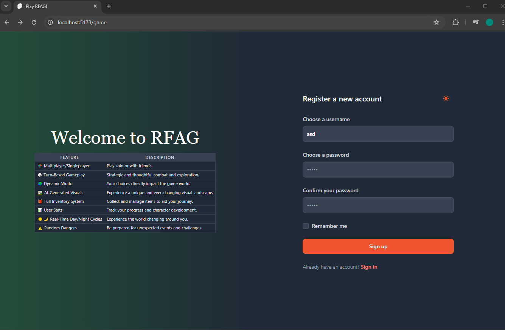

# RFAG (real-fun-ai-game) 🎮

[**View Media**](https://github.com/Synchr0nic/real-fun-ai-game/wiki/Media)

**RFAG (real-fun-ai-game): A multiplayer/singleplayer turn-based RPG where your choices shape a dynamic world. Experience adventures with AI-generated visuals, a full inventory system, user stats, real-time day/night cycles, and unexpected dangers that can randomly occur.**

## About 📖

RFAG is a unique RPG experience that blends traditional turn-based gameplay with dynamic AI-generated visuals. Explore a world shaped by your decisions, manage your inventory and stats, and navigate a world with real-time day/night cycles ☀️🌙. Be prepared for unexpected dangers that can randomly occur, adding an element of surprise to your adventures ⚠️.

## Features ✨

| Feature                 | Description                                                                                                |
| ----------------------- | ---------------------------------------------------------------------------------------------------------- |
| 🧑‍🤝‍🧑 Multiplayer/Singleplayer | Play solo or with friends.                                                                                |
| 🎲 Turn-Based Gameplay   | Strategic and thoughtful combat and exploration.                                                              |
| 🌍 Dynamic World        | Your choices directly impact the game world.                                                                  |
| 🖼️ AI-Generated Visuals | Experience a unique and ever-changing visual landscape.                                                      |
| 🎒 Full Inventory System | Collect and manage items to aid your journey.                                                                |
| 📊 User Stats           | Track your progress and character development.                                                              |
| ☀️🌙 Real-Time Day/Night Cycles | Experience the world changing around you.                                                                |
| ⚠️ Random Dangers       | Be prepared for unexpected events and challenges.                                                            |

## Getting Started 🚀

[!NOTE]
**Replace the placeholders below with your actual setup instructions!**

1. Clone the repository: `git clone [your-repo-url]`
2. Install dependencies: `npm install` or `bun install`
3. Run the game: `npm run start` or `bun run start`

## Contact 📧

For questions or feedback, please submit an [issue](https://github.com/Synchr0nic/real-fun-ai-game/issues).

## License

This project is NOT licensed!
